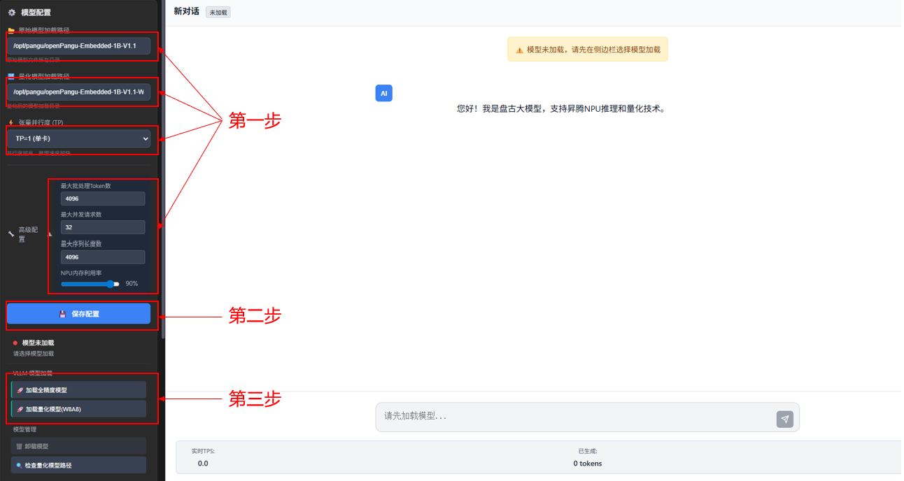
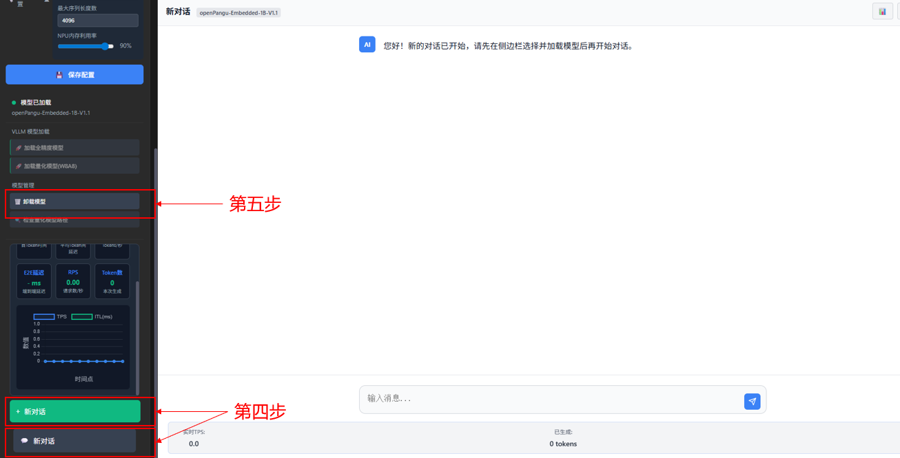
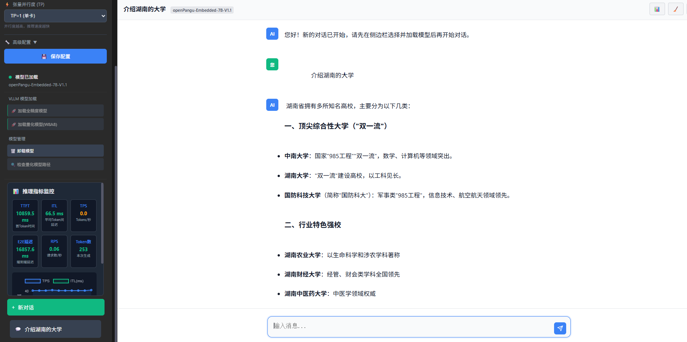

# 昇腾910B2 VLLM推理openPangu盘古7B大模型指南

本项目旨在：
1. 在华为昇腾910B2服务器上搭建openPangu-7B\1B大模型的推理对话与性能测试的web服务，并且容器化运行。
2. 适配盘古大模型的W8A8量化脚本，以及支持W8A8量化模型推理。

>注：项目主目录路径：vllm_pangu_web

## 一、从零构建镜像与容器环境：

从零构建所需镜像与容器配置参照：[vllm_pangu_web/docker/README.md](./docker/README.md)

注：关于**盘古模型的下载**，可参考华为盘古模型官方gitcode仓库：
1. openPangu-Embedded-7B-V1.1模型：
https://ai.gitcode.com/ascend-tribe/openPangu-Embedded-7B-V1.1
2. openPangu-Embedded-1B-V1.1模型：
https://ai.gitcode.com/ascend-tribe/openPangu-Embedded-1B-V1.1

模型的下载之前需要安装git-lfs(https://git-lfs.com)，ubuntu系统的安装命令如下：

```
apt-get install git-lfs
```
完成git-lfs安装后即可在当前目录下载openPangu7B和openPange1B模型：

```
git lfs install
git clone https://atomgit.com/ascend-tribe/openPangu-Embedded-1B-V1.1.git
git clone https://atomgit.com/ascend-tribe/openPangu-Embedded-7B-V1.1.git
```
本项目默认以/**opt/pangu**为盘古模型所在目录，用于后续说明

## 二、容器环境配置
 
进入容器，并进入项目目录
```
docker exec -it <CONTAINER ID> /bin/bash
cd /workspace/vllm_pangu_web
```

根据requirements.txt安装所需环境（注意确保**llmcompressor=0.8.0、transformers=4.57.1**）
```
pip install -r requirements.txt
pip install transformers==4.57.1
```

**量化功能环境配置：**

安装ModelSlim
```
#8.2.0版本的ModelSlim仓库已经集成到vllm_pangu_web/third_party/msit目录
cd third_party/msit/msmodelslim
bash install.sh
```

关于盘古大模型openPangu-Embedded-1B\7B的W8A8量化功能的使用，详情参照：[vllm_pangu_web/quantization/README.md](./quantization/README.md)

**服务端启动：**
在服务端启动之前，需自定义映射到本地ip端口1040。方法如下：

服务器端口映射到本地端口（default 1040）
本地使用如下命令登陆服务器：
```
ssh -L 1040:localhost:1040 user_name@XXX.XXX.XXX.XXX
```

或者 本地ssh配置.ssh/config文件中 配置端口信息 如下：
```
Host huawei-910BX8
    HostName XXX.XXX.XXX.XXX
    User user_name
    LocalForward 1040 localhost:1040
    ServerAliveInterval 60
    ServerAliveCountMax 3
    IdentityFile C:\user_path\.ssh\id_rsa
```
这样使用本地的vscode ssh远程登录服务器时便自动映射端口。

完成端口映射后，进入容器的`/workspace/vllm_pangu_web/`路径下执行以下命令

```
python3 main.py
```


**服务端取消：**

后台命令行输入: Ctrl + c


## 三、主要功能

### 3.1 web页面功能

1.会话管理：支持创建、删除对话，促进交互
2.智能对话：支持Markdown风格的文本输出，丰富文本渲染
3.模型管理：支持不同参数规格的盘古大模型加载、卸载
4.状态管理：支持状态检查、按钮管理、页面刷新
5.性能测试：支持推理指标监控

web主要使用流程：

1. 修改左侧边栏自定义的**原始模型加载路径**、**量化模型加载路径**、**张量并行度**
（有几张卡就可以支持几个并行度），对应的**高级配置**也可以展开进行修改；
2. 点击**保存配置**；
3. 选择并点击VLLM模型加载：**加载全精度模型**或**加载量化模型W8A8**，然后等待模型加载，30~50秒，加载进程信息可详见后台日志。
4. 模型加载完成后，点击**新对话**创建一个对话，并选择创建的对话，此时可以进行正常对话了，在模型回答问题时，将输出实时指标在侧边栏的**推理指标监控**模块。
5. 点击侧边栏的**卸载模型**，完成模型卸载。

如下方所示：



对话效果显示：


### 3.2 提供脚本功能

1.W8A8量化

支持盘古大模型openPangu-Embedded-1B\7B的W8A8量化，详情参照：[vllm_pangu_web/quantization/README.md](./quantization/README.md)

### 4.3 性能测试统计

基于华为昇腾910B2X8服务器测试，单卡TP=1的情况下：

| LLM | 实时token/s | 实时Token间延迟（ms） |
|-------|-------|-------|
| openPangu-Embedded-7B-V1.1 | 41~42 | 24.76~25.52 |
| openPangu-Embedded-7B-V1.1-W8A8-Dynamic-Per-Token | 53~55 | 18.64~19.68 |
| openPangu-Embedded-1B-V1.1 | 58~60 | 17.00~18.06 |
| openPangu-Embedded-1B-V1.1-W8A8-Dynamic-Per-Token | 61~63 | 15.84~16.82 |


## 五、主要目录结构：
```
vllm_pangu_web/
├── 📄 main.py                      # 主程序入口
├── 📄 config.py                    # 配置管理
├── 📄 README.md                    # 项目说明
├── 📄 model_config.json            # web加载的模型配置文件
├── 📄 requirements.txt             # requirements文件
├── 📂 app/                         # 应用核心模块
│   ├── 📄 __init__.py
│   ├── 📄 app.py                   # FastAPI应用创建
│   ├── 📂 routes/                  # API路由模块
│   │   ├── 📄 __init__.py
│   │   ├── 📄 admin.py             # 管理API路由
│   │   ├── 📄 conversation.py      # 对话API路由
│   │   └── 📄 model.py             # 模型API路由
│   ├── 📂 services/                # 业务服务层
│   │   ├── 📄 __init__.py
│   │   ├── 📄 model_service.py     # 模型管理服务
│   │   ├── 📄 quantization_service.py  # 量化服务
│   │   └── 📄 conversation_service.py  # 对话服务
│   ├── 📂 models/                  # 数据模型层
│   │   ├── 📄 __init__.py
│   │   ├── 📄 schemas.py          # Pydantic数据模型
│   │   └── 📄 state.py            # 全局状态管理
│   └── 📂 utils/                  # 工具函数
│       ├── 📄 __init__.py
│       ├── 📄 hardware.py         # 硬件检测
│       └── 📄 prompt_builder.py   # 提示词构建
│
├── 📂 templates/                 # HTML模板目录
│   ├── 📄 index.html             # 主页面模板
│   ├── 📂 assets/                # 静态资源，可放图片
│   ├── 📂 css/                   # 样式文件
│   │   ├── 📄 style.css          # 主样式表
│   │   ├── 📄 github-dark.min.css# github-dark样式表
│   │   └── 📄 responsive.css     # 响应式样式
│   └── 📂 js/                    # JavaScript文件
│       ├── 📄 app.js             # 主应用逻辑
│       ├── 📄 api.js             # API接口封装
│       ├── 📄 chart.umd.min.js   # chart文件
│       ├── 📄 config.js          # 配置管理
│       ├── 📄 conversations.js   # 对话管理
│       ├── 📄 highlight.min.js   # highlight文件
│       ├── 📄 marked.min.js      # marked文件
│       ├── 📄 metrics.js         # 性能测试逻辑
│       ├── 📄 models.js          # 模型管理逻辑
│       ├── 📄 quantization.js    # 量化接口逻辑
│       └── 📄 ui.js              # UI交互逻辑
├── 📂 docker/                    # 容器构建脚本
│   ├── 📄 README.md              # docker构建说明
│   └── 📄 run_docker.sh          # docker构建自定义脚本
├── 📂 quantization/              # 量化
│   ├── 📄 __init__.py              
│   ├── 📄 README.md              # 量化脚本说明
│   ├── 📄 configuration_openpangu_dense.py # 盘古HF推理配置文件
│   ├── 📄 modeling_openpangu_dense.py # 盘古HF推理文件
│   ├── 📄 w8a8_int8_dynamic.py   # 量化执行脚本
│   └── 📂 vllm-inference/        # 量化测试
│       ├── 📄 run_service_1b.sh  # 盘古1b量化模型加载测试脚本
│       ├── 📄 run_service_7b.sh  # 盘古7b量化模型加载测试脚本
│       ├── 📄 test_1b.sh         # 盘古1b量化模型测试脚本
│       └── 📄 test_7b.sh         # 盘古7b量化模型测试脚本
├── 📂 third_party/               # 依赖的第三方库
│   ├── 📂 vllm-ascend/           # 集成的构建镜像的git仓库目录
│   └── 📂 msit/                  # 集成的ModelSlim安装仓库目录
```


**参考：**
https://docs.vllm.ai/projects/ascend/zh-cn/latest/user_guide/feature_guide/quantization.html
https://gitcode.com/Ascend/msit
https://github.com/vllm-project/vllm-ascend
https://ai.gitcode.com/ascend-tribe/openPangu-Embedded-7B-V1.1
https://ai.gitcode.com/ascend-tribe/openPangu-Embedded-1B-V1.1